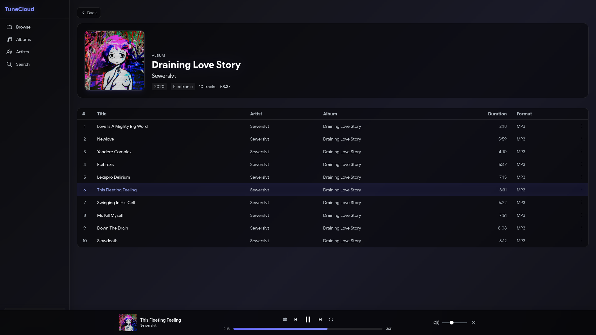
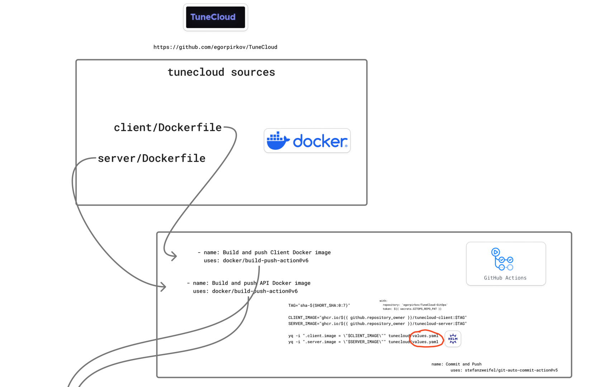
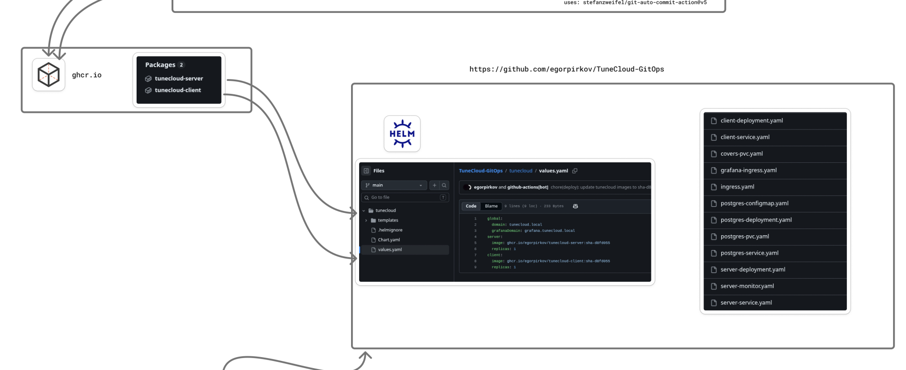
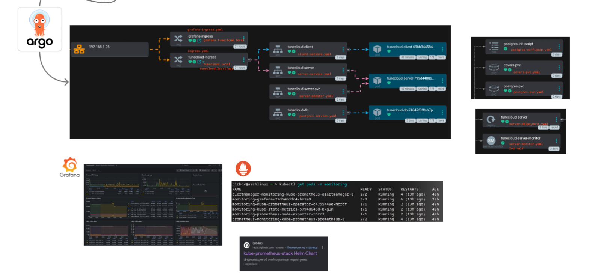

# TuneCloud - Cloud-Native Music Platform ☁️🎵

<div align="center">
    <a href="https://www.docker.com/" target="_blank" rel="noreferrer">
        
    </a>
    <a href="https://www.nginx.com/" target="_blank" rel="noreferrer">
        
    </a>
    <a href="https://www.postgresql.org/" target="_blank" rel="noreferrer">
        
    </a>
    <a href="https://kubernetes.io/" target="_blank" rel="noreferrer">
        
    </a>
    <a href="https://helm.sh/" target="_blank" rel="noreferrer">
        
    </a>
    <a href="https://argo-cd.readthedocs.io/" target="_blank" rel="noreferrer">
        
    </a>
    <a href="https://prometheus.io/" target="_blank" rel="noreferrer">
        
    </a>
    <a href="https://grafana.com/" target="_blank" rel="noreferrer">
        
    </a>
</div>

---

**TuneCloud** is a self-hosted music browser & player, designed and deployed with a strong focus on **modern DevOps practices**. 
While it serves as a fully functional music streaming platform (Node.js, PostgreSQL, React), this project's primary goal is to showcase production-grade **GitOps continuous delivery**, robust container orchestration, and comprehensive observability.

---

## 📸 Interface & Architecture Visualization








---

## 🏗️ Cloud-Native Architecture & Kubernetes

The application is deployed on a **Kubernetes (k3s)** cluster, utilizing a custom **Helm Chart** stored in a separate GitOps repository.

### Kubernetes Resources Breakdown:
- **Compute (Deployments & Pods)**: 
  - `tunecloud-server`: Node.js backend API (Fastify).
  - `tunecloud-client`: Nginx serving the React SPA.
  - `tunecloud-db`: PostgreSQL 16 database.
  - `postgres-exporter`: Exporter for PostgreSQL metrics.
- **Networking & Ingress**:
  - Services (ClusterIP & NodePort) for internal communication.
  - `ingress.yaml`: Routing traffic to `tunecloud.local` (Client) and `tunecloud.local/api` (Server).
  - `grafana-ingress.yaml`: Directing monitoring traffic to `grafana.tunecloud.local`.
- **Storage (Persistent Volumes)**:
  - `postgres-pvc`: PersistentVolumeClaim for PostgreSQL data persistence.
  - `covers-pvc`: PVC for storing music album covers.
- **Configuration**:
  - `postgres-configmap`: Initialization SQL scripts for database schema creation.
  - **Secrets Management** (External to Helm, injected via CI/CD): `ghcr-secret`, `spotify-secret`, `jwt-secret`.

---

## 🔄 CI/CD & GitOps Pipeline

The delivery pipeline is fully automated using **GitHub Actions**, **Helm**, and **ArgoCD**, adhering to strict GitOps principles.

1. **Continuous Integration (CI)**:
   - Code pushed to the `main` branch triggers GitHub Actions.
   - Multi-stage Docker builds (`client/Dockerfile`, `server/Dockerfile`) are executed.
   - Images are tagged with the short Git commit SHA and pushed to **GitHub Container Registry (ghcr.io)**.
2. **Continuous Delivery (CD) via GitOps**:
   - The CI pipeline automatically patches the `values.yaml` in the Helm GitOps repository using `yq` to update the image tags.
   - A new commit is automatically pushed to the GitOps repository.
3. **ArgoCD Synchronization**:
   - **ArgoCD** detects changes in the Helm GitOps repository and synchronizes the state with the k3s cluster, deploying the new Pods with zero downtime.

---

## 📊 Monitoring & Observability

Comprehensive monitoring is implemented using the **kube-prometheus-stack**.

- **ServiceMonitors**:
  - `server-monitor.yaml`: Scrapes custom application metrics (`/metrics` exposed via `fastify-metrics`) from the Node.js API.
  - `postgres-exporter-monitor.yaml`: Scrapes database health and performance metrics.
- **Prometheus**: Aggregates all metrics across the cluster.
- **Grafana**: Visualizes metrics through custom dashboards (accessible via `grafana.tunecloud.local`).

---

## 💻 Tech Stack Summary

| Domain | Technologies Used |
|--------|-------------------|
| **Infrastructure & Orchestration** | Kubernetes (k3s), Docker |
| **CI/CD & GitOps** | GitHub Actions, GitLab, ArgoCD, Helm, Git |
| **Monitoring & Metrics** | Prometheus, Grafana, Postgres-Exporter |
| **Backend** | Node.js 22, Fastify, PostgreSQL 16 |
| **Frontend** | React 18, Vite, Tailwind CSS 3, Nginx |

---

## 🚀 Quick Start (Local DevOps Test)

Want to run the stack locally to check out the setup?

### Docker Compose
```bash
git clone https://github.com/egorpirkov/TuneCloud.git tunecloud
cd tunecloud

# Setup environment variables
cp server/.env.example server/.env

# Spin up the entire stack
docker compose up -d --build
```

### Helm (Manual Install to K8s)
```bash
helm install tunecloud ./tunecloud -n tunecloud --create-namespace
kubectl get pods -n tunecloud
```

## 📜 License
GPL v3.0
